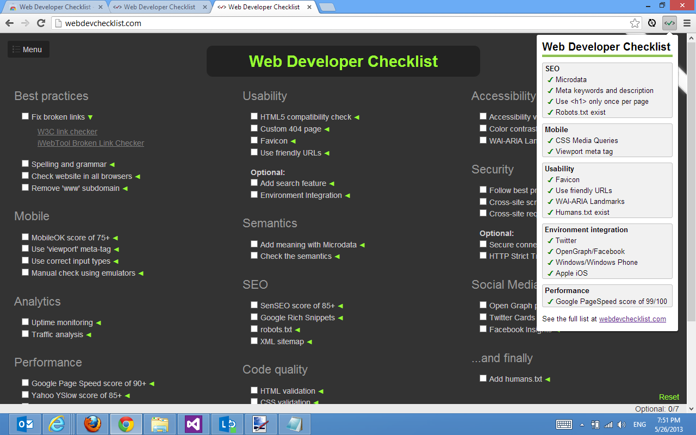

# Web Developer Checklist
A browser extension for Chrome, Firefox, Edge and Opera.

## Download

- [Google Chrome](https://chrome.google.com/webstore/detail/web-developer-checklist/iahamcpedabephpcgkeikbclmaljebjp)
- [Firefox](https://addons.mozilla.org/en-US/firefox/addon/webdeveloperchecklist/)
- Opera (pending approval...)
- Microsoft Edge (pending approval...)
- Safari (works from source but not uploaded to App Store)

## Rules
Various checks are performed on a website to make sure best practices are met. Those checks are handled by the rules engine.

These are the rules:

### SEO

#### Add meaning with microdata
Checks that either `itemscope` attributes or `<script type="application/ld+json">` exist.

#### Meta description
Checks that `<meta name="description" />` exist in the `<head>`.

#### Robots.txt exist
Checks if `robots.txt` exist in the root of the website.

### Mobile

#### CSS media queries
Checks if `@media` exist in any linked stylesheet.

#### Viewport meta tag
Checks that `<meta name="viewport" />` exist in the `<head>`.

### Usability

#### Favicon
Checks that either `<link rel="shortcut icon" />` or `<meta itemtype="image">` exist in the `<head>`. If not, it checks if `favicon.ico` exist in the root of the website.

#### Use friendly URLs
Checks that the URL doesn't contain any URL parameters. Technically, it checks if a `?` exist in the URL.

#### HTML validator
Runs HTML validation to ensure the website adhere to the W3C HTML standard.

### Accessibility

#### WAI-ARIA Landmarks
Check that a `role` attribute exist on any element on the webste.

#### Use 'alt' attributes on images
Checks all images for missing `alt` attributes.

### Environment integration

#### Twitter cards
Checks that `<meta name="twitter:title" />` exist.

#### OpenGraph/Facebook
Checks that `<meta property="og:*" />` exist on the website.

#### Windows
Checks that either `<meta name="application-name" />` or `<meta name="msapplication" />` exist.

#### Apple iOS
Checks that `<link rel="apple-*" />` exist on the website.

### Performance

#### Number of DOM elements
Checks that the number of DOM elements on the page doesn't exeed 2000.

#### Google PageSpeed score
Checks the page on Google PageSpeed Insights to make sure it gets a score of at least 90.

## Developers
To fork and build your own copy of this extension, simply clone the repo and run `npm run build`.